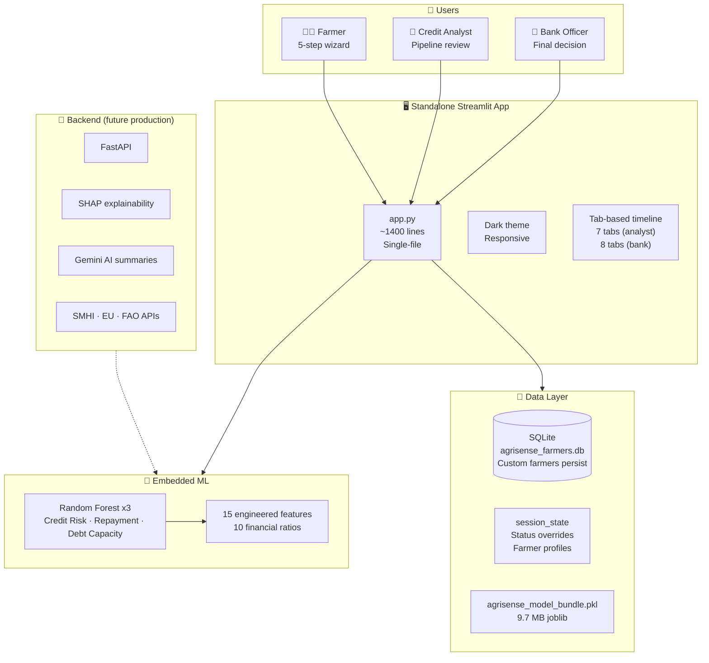
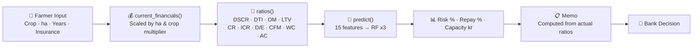
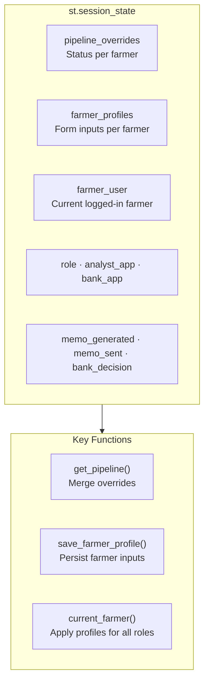
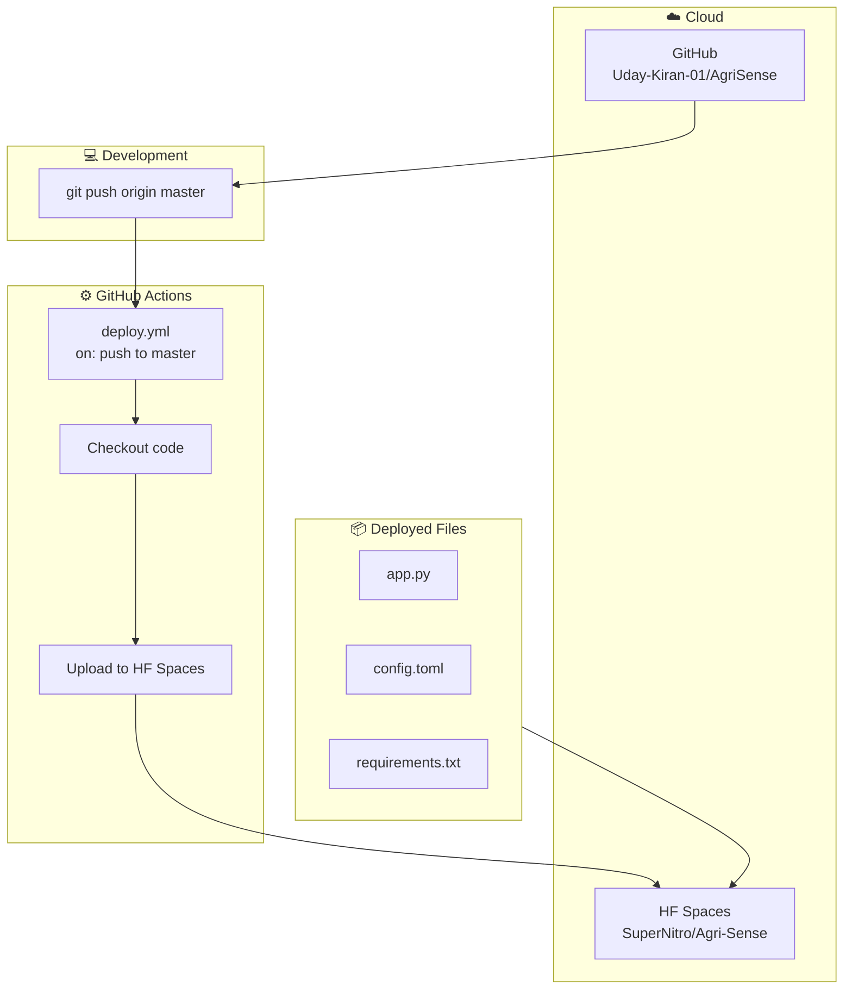

# AgriSense AI - Architecture Overview

> View on [GitHub](https://github.com/Uday-Kiran-01/AgriSense) for live Mermaid diagrams.  
> Export to PNG: copy any diagram into [mermaid.live](https://mermaid.live)

---

## System Architecture (HF Spaces Deployment)

---

## Data Flow

---

## Session State Architecture

---

## Deployment

**CI/CD:** Every `git push` to master triggers a GitHub Actions workflow that auto-deploys `app.py`, `.streamlit/config.toml`, and `requirements.txt` to HF Spaces. The model bundle (`agrisense_model_bundle.pkl`) is stored directly on HF Spaces since it rarely changes. Deploy time: ~30 seconds.

---

## Tech Stack

| Layer | Technology | Why |
|-------|-----------|-----|
| Frontend | Streamlit 1.36 | Rapid prototyping, Python-native, single-file deploy |
| ML | scikit-learn RF x 3 | Explainable, tabular data, joblib serialized |
| Features | 15 engineered + 10 financial ratios | Transparent, auditable formulas |
| Storage | SQLite (built-in) | Zero-config, custom farmers persist across restarts |
| State | st.session_state | Pipeline overrides, farmer profiles survive reruns |
| Deploy | HF Spaces + GitHub | Free, auto-rebuild, no backend needed |
| Backend (future) | FastAPI + SHAP + Gemini | For production: explainability, APIs, auth |

---

## What the Demo App Actually Computes

| Component | Real or Demo | Details |
|-----------|-------------|---------|
| 10 financial ratios | **Real** | Standard formulas (DSCR=EBITDA/TDS, DTI=debt/revenue, etc.) |
| ML predictions | **Real** | Random Forest x3 on 15 features via joblib |
| Feature scaling | **Real** | ha_scale + crop_multiplier from farmer input |
| Scenario simulation | **Real** | Re-runs predict() with modified drought/price params |
| Pipeline status flow | **Real** | Draft → Submitted → In Review → Sent to Bank → Approved/Rejected |
| Custom farmer registration | **Real** | SQLite persistence, auto-login after registration |
| External intelligence | **Demo** | Template-based weather/prices, not live APIs |
| Farmer data (8 built-in) | **Demo** | Synthetic Swedish farmers, GDPR-safe |

