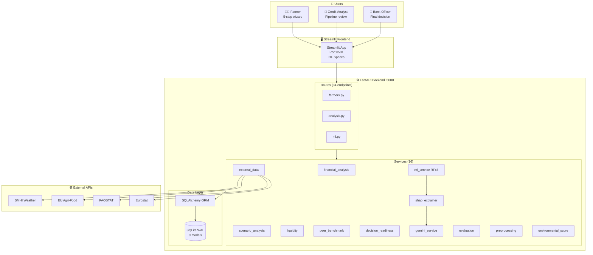
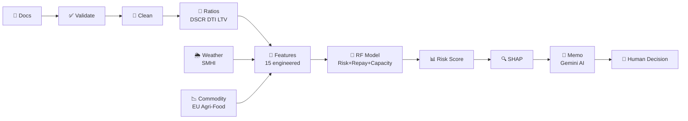
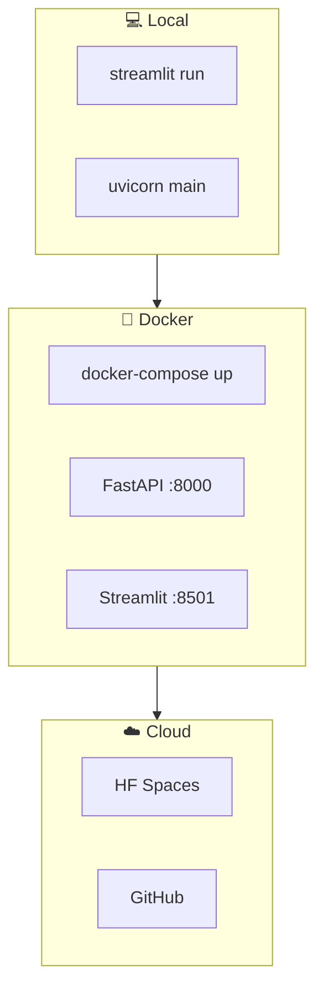

# AgriSense AI — Architecture Overview

> View on [GitHub](https://github.com/Uday-Kiran-01/AgriSense/blob/main/docs/architecture.md) for live Mermaid diagrams.  
> Export to PDF/PNG: copy any diagram block into [mermaid.live](https://mermaid.live)

---

## System Architecture

---

## Data Flow

---

## Deployment

---

## Tech Stack

| Layer | Technology | Why |
|-------|-----------|-----|
| Frontend | Streamlit 1.36 | Rapid prototyping, Python-native |
| Backend | FastAPI 3.11 | Async, OpenAPI, API-first |
| ML | scikit-learn RF × 3 | Explainable, tabular data |
| Explainability | SHAP + Gemini AI | Per-prediction + plain language |
| Database | SQLite WAL + SQLAlchemy | Simple, replaceable |
| Container | Docker compose | Reproducible |
| Deploy | HF Spaces + GitHub | Free, auto-rebuild |
| APIs | SMHI, EU, FAOSTAT, Eurostat | Real Swedish/EU data |
