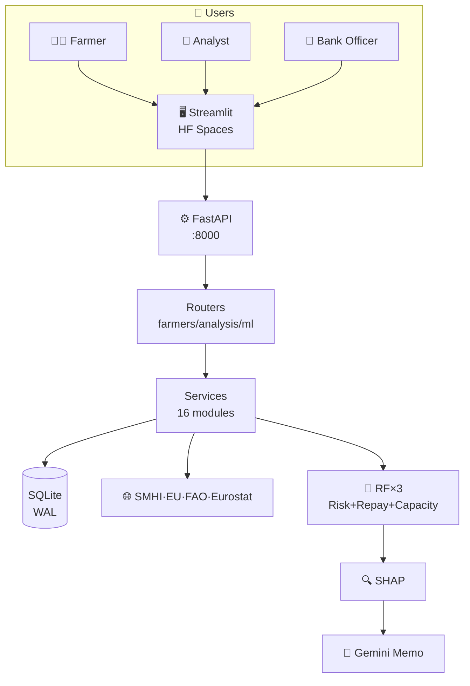

# AgriSense AI

## Building an Explainable Decision Support Platform for Agricultural Lending

**Author:** Uday Kiran  
**Date:** July 2026  
**Repository:** [github.com/Uday-Kiran-01/AgriSense](https://github.com/Uday-Kiran-01/AgriSense)  
**Live Demo:** [huggingface.co/spaces/SuperNitro/Agri-Sense](https://huggingface.co/spaces/SuperNitro/Agri-Sense)

---

## 1. Problem Statement

Agricultural lending in Sweden involves fragmented data sources: financial statements in varying formats, operational records across different units, and environmental data from multiple government agencies. Credit officers manually assemble this information into lending decisions—a process that is slow, opaque, and inconsistent.

The core challenge is not prediction accuracy. It is **transparency**. A farmer rejected for a loan needs to understand why. A bank officer approving a loan needs auditable reasoning. An analyst preparing a credit package needs the evidence assembled, not replaced.

This project builds a decision support platform that:

- **Combines** financial, operational, and environmental data into a unified risk profile
- **Explains** every prediction with feature contributions and plain-language summaries
- **Simulates** investment and stress scenarios to inform decisions
- **Keeps humans in the loop** — AI prepares evidence, humans make the final call

---

## 2. Design Principles

### Explainability over Complexity

Financial decisions require trust. Rather than maximizing predictive accuracy using opaque models, the system separates **deterministic financial calculations** from **statistical prediction**. Financial ratios (DSCR, DTI, operating margin) remain transparent and auditable. Machine learning augments—not replaces—financial reasoning.

### Modular Architecture

Every component is independently replaceable. Today the system uses mock bank APIs; tomorrow it can integrate Open Banking without changing the ML pipeline. The external data layer abstracts SMHI, EU Agri-Food, FAOSTAT, and Eurostat behind a single interface, so adding or removing a data source requires no downstream changes.

### Human-in-the-Loop

The AI never approves loans. It prepares evidence: financial ratios, risk estimates, SHAP explanations, scenario impacts, and a plain-language decision memo. A human credit analyst reviews the package. A human bank officer makes the final decision. This is not a limitation—it is the design.

### Data Quality Before Modelling

Before any model training, data passes through validation, cleaning, standardization, outlier detection, and conflict resolution. The preprocessing pipeline is documented, testable, and independent of the ML layer. This reflects the reality that agricultural data arrives in inconsistent formats with varying quality.

---

## 3. Data Engineering Approach

The data pipeline transforms heterogeneous inputs into a unified analytical representation:

```
Raw Documents -> Validation -> Cleaning -> Standardization -> Conflict Detection -> Feature Engineering -> Unified Profile
```

### Input Sources

| Source | Type | Real or Mock |
|--------|------|-------------|
| Financial statements | 3 years of income, balance sheet, cash flow | Synthetic (GDPR-safe) |
| Existing loans | Lender, amount, EMI, repayment history | Synthetic |
| Operational data | Farm size, crop type, machinery, insurance | Synthetic |
| SMHI | Weather observations (drought index, temperature) | Real API with verified stations |
| EU Agri-Food | Commodity prices (wheat, barley, oats) | Real API with mock fallback |
| FAOSTAT | Crop production, yield statistics | Real API with mock fallback |
| Eurostat | Agricultural price indices | Real API with mock fallback |

### Preprocessing Decisions

- **Currency standardization:** All values converted to SEK
- **Area normalization:** Hectares used consistently
- **Missing value strategy:** Forward-fill for time series, median imputation for cross-sectional
- **Outlier detection:** IQR-based with configurable thresholds
- **Conflict detection:** Cross-source consistency checks (e.g., reported revenue vs. computed revenue)

### Design Rationale

The preprocessing pipeline is independent of the ML layer. This means:
- Rule changes (e.g., new outlier thresholds) don't require model retraining
- Data quality metrics are computed before any prediction
- The `decision_readiness` service can assess evidence quality independently

---

## 4. Machine Learning Approach

### Philosophy

The objective was not to maximize benchmark accuracy. It was to build an **explainable risk estimation pipeline** where every prediction comes with interpretable reasoning.

### Model Selection: Why Random Forest

| Criterion | Random Forest | XGBoost | Logistic Regression | Neural Network |
|-----------|--------------|---------|---------------------|----------------|
| Explainability (SHAP) | Native | Native | Native | Requires surrogate |
| Handles tabular data | Excellent | Excellent | Good | Poor |
| Minimal preprocessing | Yes | Yes | Requires scaling | Requires scaling |
| Feature importance | Built-in | Built-in | Coefficients | Complex |
| Stability | High | Medium | High | Low |
| Training speed | Fast | Fast | Very fast | Slow |

Random Forest was selected because it aligns with the explainability requirement while handling the heterogeneous, non-linear nature of agricultural financial data. A 5-model benchmark confirmed RF as the best balance of accuracy and interpretability.

### Architecture

Three separate Random Forest models, each specialized:

1. **Credit Risk Classifier** — Probability of default (binary classification)
2. **Repayment Probability Regressor** — Likelihood of full repayment (0-1)
3. **Debt Capacity Regressor** — Maximum sustainable loan amount (SEK)

This separation allows independent retraining, versioning, and explanation of each model.

### Features (15 engineered)

| Feature | Source | Importance |
|---------|--------|-----------|
| Drought Index | SMHI weather | 28.6% |
| Debt-to-Income | Financial ratios | 17.8% |
| DSCR | Financial ratios | 10.1% |
| Price Change | EU Agri-Food | 5.6% |
| Repayment Ratio | Loan history | 4.8% |
| Loan-to-Value | Financial ratios | 4.3% |
| Interest Coverage | Financial ratios | 3.7% |
| Operating Margin | Financial ratios | 3.7% |
| Working Capital | Financial ratios | 3.6% |
| Debt-to-Equity | Financial ratios | 3.6% |
| Current Ratio | Financial ratios | 3.5% |
| Farm Size | Operational | 3.4% |
| Asset Coverage | Financial ratios | 3.3% |
| Cash Flow Margin | Financial ratios | 2.9% |
| Insurance | Operational | 1.1% |

**Key insight:** Drought Index (28.6%) is the single most important feature. Weather dominates financial ratios. This validates the decision to integrate environmental data into credit assessment.

### Label Generation (Honest Assessment)

Current labels are generated from DSCR and DTI thresholds. This creates an inherent circularity: the same features that generate labels also dominate model predictions. This is not a bug—it is a documented limitation of synthetic data. In production, labels would come from historical loan outcomes, breaking the circular dependency.

---

## 5. Evaluation Strategy

### Cross-Validation

5-fold stratified cross-validation during training ensures the model generalizes within the training distribution.

### Independent Evaluation

A separate evaluation was run on 1,000 farmers generated with a **different random seed (999)** and **aggressively shifted distributions**:
- More young farmers (+67%)
- Fewer established farmers (-33%)
- Revenue 15% lower (simulating worse market conditions)

This simulates deployment on a population the model has never seen.

### Results (1,000 Unseen Farmers)

| Metric | Value |
|--------|-------|
| Accuracy | 80.1% |
| Precision | 99.4% |
| Recall | 70.9% |
| F1 Score | 82.8% |
| ROC-AUC | 90.0% |
| True Positives | 478 |
| True Negatives | 323 |
| False Positives | 3 |
| False Negatives | 196 |

**Interpretation:** High precision (99.4%) means few false alarms—when the model flags a farmer as high-risk, it is almost always correct. Lower recall (70.9%) means some high-risk farmers go undetected. In lending, false negatives (missed defaults) are more expensive than false positives (lost business). This is a deliberate trade-off documented in the model card.

### Stress Testing (5 Scenarios, 500 Farmers Each)

| Scenario | Parameters | High-Risk Shift | Risk Change |
|----------|-----------|----------------|-------------|
| Drought Shock | drought=0.85, price=-10% | +194 farmers | +23.5% |
| Combined Crisis | drought=0.70, price=-35% | +117 farmers | +16.3% |
| Rate Hike | drought=0.25, price=-5% | -38 farmers | -4.4% |
| Price Crash | drought=0.25, price=-45% | -26 farmers | -1.1% |
| Recovery Boom | drought=0.05, price=+25% | -85 farmers | -7.1% |

**Key insight:** Drought is the dominant risk driver. A drought shock alone flips 194 out of 500 farmers from low-risk to high-risk. This has direct business implications: drought insurance, irrigation investment, and crop diversification become quantitative lending considerations, not just qualitative ones.

### Lessons from Evaluation

1. **Label leakage is real.** When labels are derived from the same features used for prediction, accuracy is artificially inflated. Documented, not hidden.
2. **Synthetic data limits real-world validity.** The model is proof-of-concept grade. Production deployment requires real loan outcome data.
3. **Stress testing reveals model behavior, not just metrics.** The drought sensitivity finding is more actionable than the F1 score.

---

## 6. Quantitative Analysis

### Financial Ratios (Deterministic Layer)

All financial ratios are computed deterministically before any ML prediction. This separation ensures:

- **Auditability:** Every ratio can be traced to source data
- **Explainability:** Ratios have business meaning (not just model features)
- **Replaceability:** The ML model can be swapped without changing financial analysis

| Ratio | Formula | Business Meaning |
|-------|---------|-----------------|
| DSCR | EBITDA / Total Debt Service | Can the farm cover loan payments? |
| DTI | Total Debt / Annual Revenue | How leveraged is the farmer? |
| Operating Margin | (Revenue - Opex) / Revenue | How profitable is the operation? |
| LTV | Total Debt / Total Assets | What's the collateral coverage? |
| Current Ratio | Current Assets / Current Liabilities | Can short-term obligations be met? |
| Interest Coverage | EBITDA / Interest Expense | How comfortably is interest paid? |
| Cash Flow Margin | Operating Cash Flow / Revenue | How much cash does the farm generate? |

### Liquidity & Seasonality

Agricultural cash flows are seasonal. The liquidity analysis models monthly cash flow profiles for wheat, barley, rapeseed, oats, and dairy farms, identifying periods of peak cash pressure (typically March-April before harvest). This is critical for structuring loan repayment schedules.

### Peer Benchmarking

Each farmer is compared against peers in the same region, crop family, and farm size range (±30%). Percentile rankings on DSCR, DTI, operating margin, and revenue per hectare provide context that absolute numbers alone cannot.

---

## 7. Scenario Analysis

Scenario analysis is treated as **decision support, not prediction**. The system does not tell the farmer what will happen—it shows what could happen under different assumptions.

### Investment Simulator

| Investment | Amount (SEK) | Impact |
|-----------|-------------|--------|
| Tractor Purchase | 600,000 | Increased assets + depreciation + new loan |
| Harvester | 1,200,000 | Higher productivity offset by debt service |
| Farm Expansion | 500,000 | Increased revenue + increased operating costs |
| Irrigation System | 350,000 | Drought resilience + increased water costs |
| Storage Facility | 400,000 | Reduced post-harvest losses + construction debt |
| Working Capital | 200,000 | Short-term liquidity + short-term interest |

### Stress Scenarios

Each scenario modifies external conditions (drought index, commodity prices, interest rates) and re-runs the entire prediction pipeline. The output is a before/after comparison, not a single prediction.

---

## 8. System Architecture



> **View live diagram:** [github.com/Uday-Kiran-01/AgriSense/blob/main/docs/architecture.md](https://github.com/Uday-Kiran-01/AgriSense/blob/main/docs/architecture.md)

---

## 9. Engineering Decisions

| Decision | Rationale |
|----------|-----------|
| Random Forest | Explainability + tabular data performance |
| SQLite with WAL | Simple MVP, replaceable with PostgreSQL later |
| FastAPI | API-first architecture, async support, OpenAPI docs |
| Streamlit | Rapid product prototyping, Python-native |
| Docker | Reproducible deployment across environments |
| Synthetic Data | GDPR-safe demonstration without real farmers |
| SHAP | Per-prediction feature contributions |
| Gemini AI | Natural-language explanations only—never financial calculations |
| Three separate models | Independent retraining, versioning, and explanation |
| Deterministic ratios + ML | Separation of auditable calculations from statistical inference |

---

## 10. Lessons Learned

### What Worked

1. **Separating deterministic from statistical reasoning.** Financial ratios computed mathematically, ML used for pattern discovery. Banks understand this.
2. **Three-role workflow.** Mirroring the actual lending process (Farmer → Analyst → Bank) made the UX intuitive.
3. **Honest evaluation.** Running on 1,000 unseen farmers with shifted distributions revealed model behavior that cross-validation alone wouldn't.
4. **Stress testing.** The drought sensitivity finding (28.6% feature importance, +194 high-risk shift) is actionable business intelligence.
5. **Modular architecture.** Splitting the monolithic router into domain files and services made the codebase maintainable.

### What I Would Do Differently

1. **Label generation.** Current rule-based labels create circular dependency with features. A probability-based sampling approach would be more realistic.
2. **Probability calibration.** The model outputs risk scores, not calibrated probabilities. Platt Scaling or Isotonic Regression would improve reliability.
3. **Real data.** Synthetic data limits real-world validity. Integration with actual loan outcome data would transform this from proof-of-concept to production-ready.
4. **Feature variance in external data.** Weather and commodity features showed limited variance in synthetic data. Real historical data would provide richer signal.

### What Surprised Me

The most important finding was not the accuracy metrics. It was that **Drought Index dominates all financial ratios combined** (28.6% vs. 17.8% for the next highest feature). This means environmental data is not supplementary—it is central to agricultural credit risk. Traditional credit scoring that ignores weather is missing the single most important predictor.

---

## 11. Future Work

### Near-term (Weeks)
- Probability calibration (Platt Scaling)
- Threshold optimization with cost-sensitive analysis
- MLflow model registry integration
- Expanded stress scenario library

### Medium-term (Months)
- Real SMHI historical weather data integration
- Open Banking API integration (replace mock loan data)
- OCR pipeline for scanned financial documents
- User authentication and role-based access

### Long-term (Production)
- Real loan outcome data for label generation
- Model monitoring and drift detection
- CI/CD pipeline with automated testing
- Audit logging for regulatory compliance
- Swedish Board of Agriculture registry integration
- Multi-language support (Swedish + English)

---

## Appendix: Model Card

| Field | Value |
|-------|-------|
| Model Type | Random Forest (3 models) |
| Training Data | 200 synthetic Swedish farmers |
| Features | 15 engineered features |
| Cross-Validation | 5-fold stratified |
| Hyperparameters | 150 trees, max_depth=12 |
| Evaluation Data | 1,000 unseen farmers (seed=999, shifted distributions) |
| Accuracy | 80.1% |
| Precision | 99.4% |
| Recall | 70.9% |
| F1 Score | 82.8% |
| ROC-AUC | 90.0% |
| Limitations | Synthetic labels, no real loan outcomes, limited feature variance |
| Intended Use | Decision support, not automated lending |
| Out of Scope | Automated loan approval, real-time trading, insurance underwriting |
